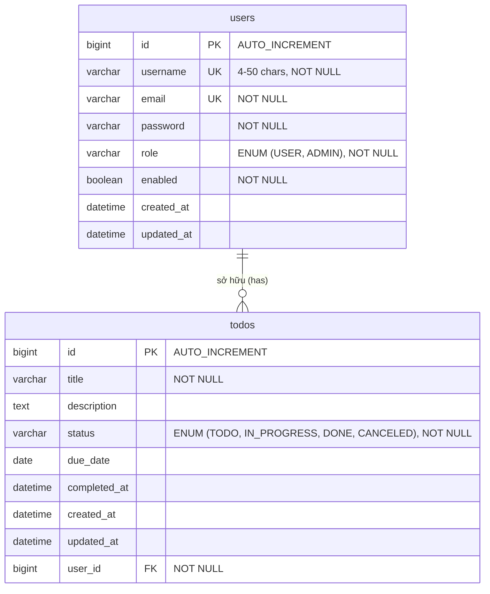
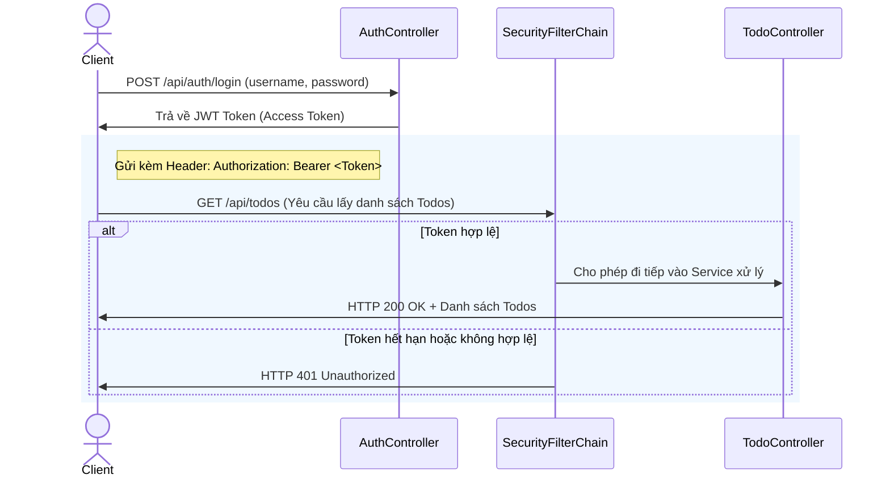

# 📝 Todo API - Spring Boot & Spring Security Backend

[](https://spring.io/projects/spring-boot)
[](https://spring.io/projects/spring-security)
[](https://www.mysql.com/)
[](https://www.oracle.com/java/)
[](LICENSE)

Dự án **Todo API** là hệ thống Backend hoàn chỉnh được xây dựng trên nền tảng **Spring Boot 3.2.5**, kết hợp **Spring Security 6** và cơ chế xác thực **JWT (JSON Web Token)**. Hệ thống cung cấp các RESTful API bảo mật và hiệu năng cao giúp quản lý công việc (Todo) cá nhân của người dùng với tính bảo mật và toàn vẹn dữ liệu ở mức tối đa.

---

## ✨ Điểm Nổi Bật Của Hệ Thống

*   🔒 **Bảo mật tuyệt đối với JWT**: Quá trình đăng nhập cấp phát Access Token có hiệu lực trong 1 giờ. Tất cả các endpoint quản lý Todo đều được bảo vệ nghiêm ngặt.
*   🛡️ **Cô lập dữ liệu người dùng (Data Isolation)**: Sử dụng các câu truy vấn thông minh (`findByIdAndUser` và `findAllByUser`) nhằm đảm bảo người dùng **chỉ** có quyền xem, sửa, xóa các Todo do chính họ tạo ra.
*   📐 **Kiến trúc phân tầng chuẩn (Layered Architecture)**: Tổ chức mã nguồn khoa học theo mô hình `Controller - Service - Repository - Entity - DTO` giúp dự án dễ bảo trì và mở rộng.
*   💥 **Xử lý ngoại lệ tập trung (Global Exception Handling)**: Định nghĩa hệ thống `ErrorCode` tùy chỉnh kết hợp ánh xạ tự động mã lỗi sang các HTTP Status Code tương ứng.
*   🔄 **MapStruct & Lombok**: Giảm thiểu tối đa code thừa (boilerplate code), tối ưu hóa tốc độ ánh xạ dữ liệu giữa DTO và Entity.
*   🎯 **Validation đầu vào chặt chẽ**: Rà soát định dạng Email, độ dài Username, Password và các trường dữ liệu bắt buộc bằng `@NotBlank`, `@Size`, `@NotNull`.

---

## 🛠️ Công Nghệ Sử Dụng (Technology Stack)

| Thành phần | Công nghệ | Phiên bản | Mô tả |
| :--- | :--- | :--- | :--- |
| **Language** | Java | 17 / 21+ | Ngôn ngữ lập trình chính |
| **Framework** | Spring Boot | 3.2.5 | Nền tảng cốt lõi của ứng dụng |
| **Security** | Spring Security | 6 | Xác thực và phân quyền dựa trên JWT |
| **JWT Library**| Nimbus JOSE + JWT | 9.x | Sinh và xác thực mã Token |
| **Database** | MySQL | 8.0 | Hệ quản trị cơ sở dữ liệu quan hệ |
| **ORM** | Spring Data JPA | 3.2.5 | Tương tác cơ sở dữ liệu thông qua Hibernate |
| **Mapping** | MapStruct | 1.5.5.Final | Tự động ánh xạ Object-to-Object |
| **Helper** | Lombok | 1.18.30 | Tự động sinh Getter, Setter, Builder |
| **Validation** | Jakarta Validation | 3.0.2 | Kiểm tra dữ liệu đầu vào |

---

## 📁 Cấu Trúc Mã Nguồn (Package Structure)

Dự án được cấu trúc theo chuẩn công nghiệp giúp dễ dàng phát triển và kiểm thử:

```text
to-do-api/
├── src/
│   ├── main/
│   │   ├── java/com/nhan/to_do_api/
│   │   │   ├── configuration/     # Cấu hình Security, CORS, OpenAPI, AppInit
│   │   │   ├── controller/        # Tầng API Controllers (Định nghĩa endpoint)
│   │   │   ├── dto/               # Đối tượng truyền tải dữ liệu (DTO)
│   │   │   │   ├── request/       # DTO đầu vào (Register, Login, Todo...)
│   │   │   │   └── response/      # DTO trả về chuẩn hóa (ApiResponse, User...)
│   │   │   ├── entity/            # Thực thể Hibernate tương ứng bảng cơ sở dữ liệu
│   │   │   ├── enums/             # Các Enum của hệ thống (Role, TodoStatus)
│   │   │   ├── exception/         # Xử lý lỗi toàn cục (Global Exception Handlers)
│   │   │   ├── mapper/            # Giao diện MapStruct dùng để convert DTO <-> Entity
│   │   │   ├── repository/        # Tầng giao tiếp với Database (Spring Data JPA)
│   │   │   ├── service/           # Tầng chứa logic nghiệp vụ chính (Business Logic)
│   │   │   └── ToDoApiApplication.java # Lớp khởi chạy ứng dụng
│   │   └── resources/
│   │       ├── application.yml    # File cấu hình cấu trúc hệ thống & Database
│   │       └── ...
│   └── test/                      # Thư mục chứa các Unit & Integration Testcases
├── pom.xml                        # Quản lý thư viện và plugin Maven
└── README.md                      # Tài liệu hướng dẫn dự án
```

---

## 🗄️ Thiết Kế Cơ Sở Dữ Liệu (Database Design)

Hệ thống sử dụng cơ sở dữ liệu quan hệ **MySQL** với 2 bảng chính có mối quan hệ **Một - Nhiều (1 - N)**:



### 1. Bảng `users` (Thông tin người dùng)
*   `id`: Khóa chính, tự động tăng.
*   `username`: Tên đăng nhập duy nhất (Unique), độ dài từ 4 đến 50 ký tự.
*   `email`: Email duy nhất (Unique), đúng định dạng email.
*   `password`: Mật khẩu được mã hóa bằng thuật toán **BCrypt Strong Hashing**.
*   `role`: Quyền hạn người dùng (`USER` hoặc `ADMIN`), lưu trữ dạng chuỗi chữ.
*   `enabled`: Trạng thái kích hoạt tài khoản (`true`/`false`).

### 2. Bảng `todos` (Danh sách công việc)
*   `id`: Khóa chính, tự động tăng.
*   `title`: Tiêu đề công việc, bắt buộc nhập, độ dài từ 4 đến 100 ký tự.
*   `description`: Mô tả chi tiết (kiểu `TEXT` trong cơ sở dữ liệu).
*   `status`: Trạng thái công việc (`TODO`, `IN_PROGRESS`, `DONE`, `CANCELED`).
*   `due_date`: Hạn hoàn thành (LocalDate).
*   `completed_at`: Thời điểm đánh dấu hoàn thành (LocalDateTime).
*   `user_id`: Khóa ngoại liên kết chặt chẽ tới bảng `users` (`ON DELETE CASCADE`).

---

## 🔒 Luồng Xác Thực & Phân Quyền (Security Flow)

Hệ thống bảo vệ toàn bộ API Todos bằng cơ chế Token-based Authentication:



---

## ✉️ Định Dạng API Response Chuẩn

Tất cả các API của hệ thống đều được trả về dưới một định dạng JSON thống nhất để Client (Frontend) dễ dàng xử lý:

### 1. Response Thành Công (Success Response)
```json
{
  "code": 1000,
  "message": "Success",
  "result": {
  }
}
```

### 2. Response Lỗi (Error Response)
```json
{
  "code": 4004,
  "message": "Invalid username or password",
  "result": null
}
```

---

## 🔌 Chi Tiết Các RESTful API Endpoints

Tất cả các API được cấu hình với tiền tố `/api`.

### 1. Xác thực & Phân quyền (Authentication APIs)

#### 📝 Đăng Ký Tài Khoản (Register)
*   **Endpoint**: `POST /api/auth/register`
*   **Quyền truy cập**: Public (Công khai)
*   **Request Body**:
    ```json
    {
      "username": "tester",
      "email": "tester@example.com",
      "password": "securepassword123"
    }
    ```
*   **Response (200 OK)**:
    ```json
    {
      "code": 1000,
      "message": "Register successfully!",
      "result": {
        "id": 1,
        "username": "tester",
        "email": "tester@example.com",
        "role": "USER",
        "enabled": true
      }
    }
    ```

#### 🔑 Đăng Nhập (Login)
*   **Endpoint**: `POST /api/auth/login`
*   **Quyền truy cập**: Public (Công khai)
*   **Request Body**:
    ```json
    {
      "username": "tester",
      "password": "securepassword123"
    }
    ```
*   **Response (200 OK)**:
    ```json
    {
      "code": 1000,
      "message": "Login successfully!",
      "result": {
        "token": "eyJhbGciOiJIUzI1NiIsInR5cCI6IkpXVCJ9.eyJzdWIiOiJ0ZXN0ZXIiLCJpc3MiOiJuaGFuLmNvbSIsImV4cCI6MTcxOTk...",
        "authenticated": true
      }
    }
    ```

---

### 2. Thông tin người dùng (User APIs)

#### 👤 Lấy Thông Tin Người Dùng Hiện Tại (Get My Info)
*   **Endpoint**: `GET /api/users/me`
*   **Quyền truy cập**: Yêu cầu Header `Authorization: Bearer <JWT_TOKEN>`
*   **Response (200 OK)**:
    ```json
    {
      "code": 1000,
      "message": "getMyInfo successfully!",
      "result": {
        "id": 1,
        "username": "tester",
        "email": "tester@example.com",
        "role": "USER",
        "enabled": true
      }
    }
    ```

---

### 3. Quản lý công việc (Todo APIs)
> [!IMPORTANT]
> Tất cả các API dưới đây đều yêu cầu truyền kèm Token xác thực trong Header:
> `Authorization: Bearer <YOUR_JWT_TOKEN>`

#### ➕ Tạo Mới Todo (Create Todo)
*   **Endpoint**: `POST /api/todos`
*   **Request Body**:
    ```json
    {
      "title": "Học Spring Security 6",
      "description": "Nghiên cứu cấu trúc JWTDecoder và SecurityFilterChain",
      "status": "TODO"
    }
    ```
*   **Response (200 OK)**:
    ```json
    {
      "code": 1000,
      "message": "Create Successfully",
      "result": {
        "id": 12,
        "title": "Học Spring Security 6",
        "description": "Nghiên cứu cấu trúc JWTDecoder và SecurityFilterChain",
        "status": "TODO",
        "dueDate": null,
        "completedAt": null,
        "createdAt": "2026-05-22T18:30:00",
        "updatedAt": "2026-05-22T18:30:00"
      }
    }
    ```

#### 📋 Lấy Danh Sách Todo Của Bản Thân (Get My Todos)
*   **Endpoint**: `GET /api/todos`
*   **Đặc điểm**: Chỉ trả về danh sách các Todo thuộc sở hữu của User đang gọi API.
*   **Response (200 OK)**:
    ```json
    {
      "code": 1000,
      "message": "Get Successfully",
      "result": [
        {
          "id": 12,
          "title": "Học Spring Security 6",
          "description": "Nghiên cứu cấu trúc JWTDecoder và SecurityFilterChain",
          "status": "TODO",
          "dueDate": null,
          "completedAt": null,
          "createdAt": "2026-05-22T18:30:00",
          "updatedAt": "2026-05-22T18:30:00"
        }
      ]
    }
    ```

#### 🔍 Xem Chi Tiết Một Todo (Get Todo By ID)
*   **Endpoint**: `GET /api/todos/{id}`
*   **Đặc điểm**: Trả về lỗi `4007 (Todo not found)` nếu ID không tồn tại hoặc Todo thuộc về người khác.
*   **Response (200 OK)**:
    ```json
    {
      "code": 1000,
      "message": "Get Successfully",
      "result": {
        "id": 12,
        "title": "Học Spring Security 6",
        "description": "Nghiên cứu cấu trúc JWTDecoder và SecurityFilterChain",
        "status": "TODO",
        "dueDate": null,
        "completedAt": null,
        "createdAt": "2026-05-22T18:30:00",
        "updatedAt": "2026-05-22T18:30:00"
      }
    }
    ```

#### 🔄 Cập Nhật Toàn Bộ Todo (Update Todo)
*   **Endpoint**: `PUT /api/todos/{id}`
*   **Request Body**:
    ```json
    {
      "title": "Học Spring Security nâng cao",
      "description": "Hoàn thành nghiên cứu OAuth2 & Refresh Token",
      "status": "IN_PROGRESS",
      "dueDate": "2026-05-25"
    }
    ```
*   **Response (200 OK)**:
    ```json
    {
      "code": 1000,
      "message": "Update Successfully",
      "result": {
        "id": 12,
        "title": "Học Spring Security nâng cao",
        "description": "Hoàn thành nghiên cứu OAuth2 & Refresh Token",
        "status": "IN_PROGRESS",
        "dueDate": "2026-05-25",
        "completedAt": null,
        "createdAt": "2026-05-22T18:30:00",
        "updatedAt": "2026-05-22T18:35:10"
      }
    }
    ```

#### 📍 Cập Nhật Nhanh Trạng Thái (Patch Status)
*   **Endpoint**: `PATCH /api/todos/{id}/status`
*   **Request Body**:
    ```json
    {
      "status": "DONE"
    }
    ```
*   **Response (200 OK)**:
    ```json
    {
      "code": 1000,
      "message": "Toggle Complete",
      "result": {
        "id": 12,
        "title": "Học Spring Security nâng cao",
        "description": "Hoàn thành nghiên cứu OAuth2 & Refresh Token",
        "status": "DONE",
        "dueDate": "2026-05-25",
        "completedAt": "2026-05-22T18:40:00",
        "createdAt": "2026-05-22T18:30:00",
        "updatedAt": "2026-05-22T18:40:00"
      }
    }
    ```

#### ❌ Xóa Todo (Delete Todo)
*   **Endpoint**: `DELETE /api/todos/{id}`
*   **Response (200 OK)**:
    ```json
    {
      "code": 1000,
      "message": "Delete Successfully",
      "result": null
    }
    ```

---

## 🎯 Bảng Ánh Xạ Mã Lỗi Hệ Thống (ErrorCode System)

Khi ứng dụng xảy ra ngoại lệ, hệ thống sẽ trả về mã lỗi đặc trưng trong JSON body thay vì mặc định Spring Boot Trace:

| Mã lỗi (code) | Thông điệp lỗi (message) | HTTP Status tương ứng | Mô tả chi tiết |
| :--- | :--- | :--- | :--- |
| **1000** | Success | `200 OK` | Yêu cầu được xử lý thành công |
| **4000** | Invalid request | `400 Bad Request` | Lỗi Validation dữ liệu đầu vào chung |
| **4001** | User not found | `404 Not Found` | Không tìm thấy thông tin tài khoản |
| **4002** | Username already exists | `400 Bad Request` | Tên đăng nhập đã bị đăng ký trước đó |
| **4003** | Email already exists | `400 Bad Request` | Địa chỉ email đã tồn tại trong hệ thống |
| **4004** | Invalid username or password | `401 Unauthorized` | Tên đăng nhập hoặc mật khẩu không chính xác |
| **4005** | Unauthorized | `401 Unauthorized` | Người dùng chưa đăng nhập hoặc token không hợp lệ |
| **4006** | Forbidden | `403 Forbidden` | Người dùng không đủ quyền truy cập tài nguyên |
| **4007** | Todo not found | `404 Not Found` | Không tìm thấy Todo hoặc không có quyền sở hữu |
| **4011** | Invalid todo status | `400 Bad Request` | Trạng thái Todo gửi lên không hợp lệ |
| **4012** | Invalid due date | `400 Bad Request` | Ngày đến hạn công việc không hợp lệ |
| **4014** | Enum is Wrong | `400 Bad Request` | Parse enum JSON không đúng định dạng (Ví dụ: trạng thái viết sai) |
| **5000** | Internal server error | `500 Server Error` | Lỗi phát sinh ngoài ý muốn từ phía hệ thống |
| **7005** | User disabled | `403 Forbidden` | Tài khoản người dùng đã bị khóa hoặc tạm dừng hoạt động |

---

## 🚀 Hướng Dẫn Cài Đặt & Khởi Chạy (Getting Started)

### 📋 Yêu Cầu Môi Trường (Prerequisites)
*   **Java**: JDK 17 hoặc cao hơn (khuyên dùng JDK 21).
*   **Maven**: Phiên bản 3.8+ dùng để quản lý dependencies và build.
*   **MySQL Server**: Phiên bản 8.0+.

---

### ⚙️ Hướng Dẫn Từng Bước (Step-by-Step Setup)

#### Bước 1: Khởi Tạo Cơ Sở Dữ Liệu
Hãy mở MySQL Client hoặc Workbench và thực thi câu lệnh SQL để tạo cơ sở dữ liệu:
```sql
CREATE DATABASE todo_app CHARACTER SET utf8mb4 COLLATE utf8mb4_unicode_ci;
```

#### Bước 2: Cấu Hình Hệ Thống
Chỉnh sửa file cấu hình `src/main/resources/application.yml` để điền chính xác thông tin đăng nhập MySQL của máy bạn:
```yaml
spring:
  datasource:
    url: jdbc:mysql://localhost:3306/todo_app?useSSL=false&serverTimezone=UTC
    username: <YOUR_MYSQL_USERNAME>  # Mặc định là root
    password: <YOUR_MYSQL_PASSWORD>  # Mặc định là root
```

#### Bước 3: Biên Dịch Ứng Dụng (Build)
Mở cửa sổ dòng lệnh (Terminal) tại thư mục gốc dự án và thực hiện biên dịch bằng Maven:
```bash
mvn clean install
```
> [!NOTE]
> Dự án sử dụng song song **Lombok** và **MapStruct**, cấu hình biên dịch tự động sinh mã nguồn lớp mapper đã được sắp xếp chính xác trong `pom.xml`. Lệnh build sẽ chạy mượt mà mà không có bất cứ xung đột nào.

#### Bước 4: Khởi Chạy Ứng Dụng (Run)
Sử dụng lệnh Maven để chạy server:
```bash
mvn spring-boot:run
```
Sau khi server khởi động thành công, logs sẽ thông báo ứng dụng đã lắng nghe tại cổng `8080` với context-path `/api`:
```text
[INFO] Tomcat started on port 8080 (http) with context path '/api'
[INFO] Started ToDoApiApplication in 2.345 seconds
```

#### Bước 5: Chạy Kiểm Thử Tự Động (Test Suite)
Dự án đã tích hợp đầy đủ hệ thống unit tests kiểm tra chặt chẽ luồng Auth, User và Todo Services. Bạn có thể chạy toàn bộ testcases thông qua:
```bash
mvn clean test
```

---

## 🧪 Quy Trình Nghiệm Thu & Kiểm Thử Thủ Công

Bạn có thể dễ dàng kiểm thử các API bằng **Postman** theo các bước khuyến nghị sau để nghiệm thu dự án:

1.  **Đăng ký tài khoản (Register)**:
    *   Gọi `POST http://localhost:8080/api/auth/register` để tạo tài khoản mới.
2.  **Đăng nhập hệ thống (Login)**:
    *   Gọi `POST http://localhost:8080/api/auth/login` bằng thông tin vừa tạo.
    *   **Sao chép (Copy)** chuỗi `token` nhận được trong phần `result.token`.
3.  **Thiết lập Authorization trong Postman**:
    *   Chọn tab **Authorization**, chọn Type là **Bearer Token**.
    *   Dán (Paste) chuỗi token đã sao chép ở bước trước vào.
4.  **Kiểm tra tính cô lập dữ liệu (Security Check)**:
    *   Tạo tài khoản thứ 2 và tạo Todo bất kỳ.
    *   Dùng Token của tài khoản thứ 1 cố tình gửi request `GET /api/todos/{id_todo_cua_tai_khoan_2}` hoặc `DELETE` -> Hệ thống sẽ lập tức chặn lại và trả về mã lỗi `4007 (Todo not found)`. Chứng minh hệ thống phân quyền cực kỳ chặt chẽ và an toàn!

---

Chúc bạn có trải nghiệm tuyệt vời cùng với **Spring Boot Todo API**! Mọi ý kiến phản hồi hoặc đóng góp phát triển vui lòng tạo Issue trên Repository. 🚀
