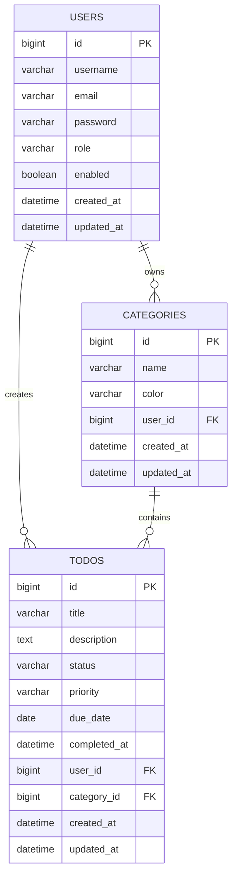

# Todo App API - Project Requirements

## 1. Project Overview

Build a backend REST API for a personal Todo App using Spring Boot 3.

The system allows users to register, login, manage their own todos, organize todos by categories, filter/search todos, and protect data using JWT authentication.

This project is intended to practice real backend development with:

- Java 21
- Spring Boot 3
- Spring Web
- Spring Data JPA
- Spring Security
- JWT Authentication
- MySQL
- Validation
- Global Exception Handling
- Docker
- Docker Compose
- Unit Test / Controller Test
- Swagger/OpenAPI

---

## 2. Main Goals

The project should help practice:

1. Building REST APIs with Spring Boot 3.
2. Designing DTO request/response classes.
3. Using MySQL with Spring Data JPA.
4. Implementing JWT authentication.
5. Protecting APIs with Spring Security.
6. Handling validation and business errors.
7. Applying clean project structure.
8. Running the application with Docker and Docker Compose.
9. Writing basic tests.
10. Creating a clean README for portfolio.

---

## 3. Tech Stack

### Backend

- Java 21
- Spring Boot 3
- Spring Web
- Spring Data JPA
- Spring Security
- Spring Validation
- MySQL Driver
- Lombok
- JWT library
- Swagger/OpenAPI

### Database

- MySQL 8

### DevOps

- Docker
- Docker Compose

### Testing

- JUnit 5
- Mockito
- Spring Boot Test
- MockMvc

Optional advanced:

- TestContainers
- JaCoCo

---

## 4. Project Structure

```text
todo-app-api
└── src/main/java/com/nhan/todoapp
    ├── configuration
    ├── controller
    ├── dto
    │   ├── request
    │   └── response
    ├── entity
    ├── enums
    ├── exception
    ├── mapper
    ├── repository
    ├── security
    ├── service
    └── util
```

Suggested packages:

```text
configuration
- SecurityConfig
- OpenApiConfig
- ApplicationInitConfig

controller
- AuthController
- UserController
- TodoController
- CategoryController

dto/request
- RegisterRequest
- AuthenticationRequest
- ChangePasswordRequest
- TodoCreationRequest
- TodoUpdateRequest
- TodoStatusUpdateRequest
- CategoryCreationRequest
- CategoryUpdateRequest

dto/response
- ApiResponse
- AuthenticationResponse
- UserResponse
- TodoResponse
- CategoryResponse

entity
- User
- Todo
- Category

enums
- Role
- TodoStatus
- Priority

exception
- AppException
- ErrorCode
- GlobalExceptionHandler

repository
- UserRepository
- TodoRepository
- CategoryRepository

service
- AuthenticationService
- UserService
- TodoService
- CategoryService

security
- JwtTokenProvider
- JwtAuthenticationFilter
- CustomUserDetailsService
```

---

## 4.5. Implementation Phases (Roadmap)

Dưới đây là lộ trình từng bước (Phase by Phase) chuẩn xác để bạn biết phải làm gì trước, làm gì sau khi phát triển API này:

### Phase 1: Database & Entities (Nền tảng dữ liệu)
- **Mục tiêu:** Thiết kế cơ sở dữ liệu và ánh xạ sang code Java.
- **Công việc:**
  1. Cấu hình kết nối MySQL trong `application.yml`.
  2. Tạo các `Enum` (`Role`, `TodoStatus`, `Priority`).
  3. Code các entity class trong thư mục `entity`: `User`, `Category`, `Todo`. Sử dụng các annotation của JPA (`@Entity`, `@Id`, `@OneToMany`,...).
  4. Run app để Spring Boot Auto DDL tự động tạo bảng trong MySQL.

### Phase 2: Repositories & DTOs (Tầng truy xuất và truyền tải)
- **Mục tiêu:** Tạo interface truy cập database và các object hứng/trả dữ liệu.
- **Công việc:**
  1. Tạo các interface trong `repository` (`UserRepository`, `TodoRepository`, `CategoryRepository`) kế thừa `JpaRepository`.
  2. Code các DTO (`Request` và `Response`) ở thư mục `dto` theo như tài liệu API đã định nghĩa. (Ví dụ: `RegisterRequest`, `UserResponse`, `TodoCreationRequest`...).
  3. Tạo class `ApiResponse<T>` chuẩn để bọc mọi response trả về cho Client.

### Phase 3: Exception Handling & Services (Logic nghiệp vụ và Xử lý lỗi)
- **Mục tiêu:** Xử lý các logic cốt lõi và bắt lỗi tập trung.
- **Công việc:**
  1. Định nghĩa `ErrorCode` (enum) chứa các mã lỗi (1000, 4004...).
  2. Tạo `AppException` extends `RuntimeException` và `GlobalExceptionHandler` (dùng `@RestControllerAdvice`) trong thư mục `exception`.
  3. Code logic CRUD trong `service` (`CategoryService`, `TodoService`) mà **CHƯA CẦN** dính đến Security (nghĩa là truyền chay User ID hoặc tạm fix cứng User).

### Phase 4: Controllers (Tạo API Endpoints)
- **Mục tiêu:** Mở các endpoint API để test.
- **Công việc:**
  1. Tạo các controller (`CategoryController`, `TodoController`).
  2. Map các HTTP methods (`@GetMapping`, `@PostMapping`...) gọi đến Service.
  3. Test các API này bằng Postman hoặc Swagger để đảm bảo logic CRUD và Exception hoạt động đúng.

### Phase 5: Spring Security & JWT (Bảo mật)
- **Mục tiêu:** Khóa các API lại và yêu cầu đăng nhập.
- **Công việc:**
  1. Thêm cấu hình Security `SecurityConfig`, mã hóa mật khẩu `PasswordEncoder`.
  2. Code `JwtTokenProvider` (tạo và parse token) và `JwtAuthenticationFilter` (chặn request để kiểm tra token).
  3. Hoàn thiện `AuthenticationService` và `AuthController` (API Register, Login).
  4. Cập nhật lại `TodoService` và `CategoryService` để lấy User ID thực tế từ Security Context (`SecurityContextHolder`).

### Phase 6: Refactoring & Testing (Hoàn thiện)
- **Mục tiêu:** Code sạch hơn và viết test.
- **Công việc:**
  1. Sử dụng MapStruct (hoặc tự viết Mapper) trong thư mục `mapper` để chuyển đổi Entity <-> DTO.
  2. Viết Unit Test cho Service.
  3. Viết Integration Test cho Controller.
  4. Dockerize ứng dụng (viết `Dockerfile`, `docker-compose.yml`).

---

## 5. Core Features

## 5.1 Authentication

### Features

- Register account
- Login account
- Get current user information
- Change password
- Protect APIs with JWT
- Hash password before saving to database

### APIs

```http
POST /auth/register
POST /auth/login
GET /users/me
PATCH /users/me/password
```

### Register Request

```json
{
  "username": "nhan",
  "email": "nhan@example.com",
  "password": "123456"
}
```

### Login Request

```json
{
  "username": "nhan",
  "password": "123456"
}
```

### Authentication Response

```json
{
  "code": 1000,
  "result": {
    "token": "jwt-token-here",
    "authenticated": true
  }
}
```

### Business Rules

- ~~Username must be unique.
- Email must be unique.~~
- Password must be at ~~least 6 characters~~.
- Password must be encoded before saving.
- Login fails if username does not exist.
- Login fails if password is wrong.
- Protected APIs require a valid JWT token.

---

## 5.2 User Management

### Features

- Get current user profile.
- Admin can view all users.
- Admin can lock or unlock users.

### APIs

```http
GET /users/me
GET /users
PATCH /users/{id}/status
```

### User Response

```json
{
  "id": 1,
  "username": "nhan",
  "email": "nhan@example.com",
  "role": "USER",
  "enabled": true,
  "createdAt": "2026-05-20T10:00:00",
  "updatedAt": "2026-05-20T10:00:00"
}
```

### Business Rules
[README.md](README.md)
- Normal users can only view their own profile.
- Admin can view all users.
- Locked users cannot login.
- User role is USER by default.
- Admin role may be created manually or by application initializer.

---

## 5.3 Todo Management

### Features

- Create todo
- View todo list
- View todo detail
- Update todo
- Delete todo
- Change todo status
- Search todo by keyword
- Filter todo by status
- Filter todo by priority
- Filter todo by category
- Sort todo by due date
- Pagination

### APIs

```http
POST /todos
GET /todos
GET /todos/{id}
PUT /todos/{id}
DELETE /todos/{id}
PATCH /todos/{id}/status
```

### Query APIs

```http
GET /todos?status=TODO
GET /todos?status=DONE
GET /todos?priority=HIGH
GET /todos?categoryId=1
GET /todos?keyword=spring
GET /todos?page=0&size=10&sort=dueDate,asc
```

### Create Todo Request

```json
{
  "title": "Learn Spring Security",
  "description": "Review JWT authentication",
  "priority": "HIGH",
  "dueDate": "2026-05-25",
  "categoryId": 1
}
```

### Update Todo Request

```json
{
  "title": "Learn Spring Security and JWT",
  "description": "Review security filter chain",
  "status": "IN_PROGRESS",
  "priority": "HIGH",
  "dueDate": "2026-05-26",
  "categoryId": 1
}
```

### Update Todo Status Request

```json
{
  "status": "DONE"
}
```

### Todo Response

```json
{
  "id": 1,
  "title": "Learn Spring Security",
  "description": "Review JWT authentication",
  "status": "TODO",
  "priority": "HIGH",
  "dueDate": "2026-05-25",
  "completedAt": null,
  "category": {
    "id": 1,
    "name": "Study",
    "color": "#3B82F6"
  },
  "createdAt": "2026-05-20T10:00:00",
  "updatedAt": "2026-05-20T10:00:00"
}
```

### Business Rules

- Todo title must not be blank.
- Todo belongs to the authenticated user.
- User can only view, update, or delete their own todos.
- Admin may view all todos if implemented.
- Due date should not be in the past.
- Default todo status is TODO.
- If todo status becomes DONE, set completedAt to current datetime.
- If todo status changes from DONE to another status, clear completedAt.
- If categoryId is provided, the category must belong to the current user.
- Deleting a todo should only delete the current user's todo.

---

## 5.4 Category Management

### Features

- Create category
- View category list
- Update category
- Delete category

### APIs

```http
POST /categories
GET /categories
GET /categories/{id}
PUT /categories/{id}
DELETE /categories/{id}
```

### Create Category Request

```json
{
  "name": "Study",
  "color": "#3B82F6"
}
```

### Update Category Request

```json
{
  "name": "Work",
  "color": "#EF4444"
}
```

### Category Response

```json
{
  "id": 1,
  "name": "Study",
  "color": "#3B82F6",
  "createdAt": "2026-05-20T10:00:00",
  "updatedAt": "2026-05-20T10:00:00"
}
```

### Business Rules

- Category name must not be blank.
- Category name must be unique for each user.
- User can only manage their own categories.
- Category color should be a valid hex color.
- Do not allow deleting category if it still contains todos.
- Or alternatively, when deleting category, set category of related todos to null.

Recommended rule:

- Do not allow deleting category if it still contains todos.

---

## 6. Entities & Database UML

Dưới đây là sơ đồ quan hệ thực thể (ERD) mô tả các bảng trong cơ sở dữ liệu:



## 6.1 User Entity

Fields:

```text
id: Long
username: String
email: String
password: String
role: Role
enabled: Boolean
createdAt: LocalDateTime
updatedAt: LocalDateTime
```

Relationships:

```text
User 1 - n Todo
User 1 - n Category
```

---

## 6.2 Todo Entity

Fields:

```text
id: Long
title: String
description: String
status: TodoStatus
priority: Priority
dueDate: LocalDate
completedAt: LocalDateTime
createdAt: LocalDateTime
updatedAt: LocalDateTime
```

Relationships:

```text
Todo n - 1 User
Todo n - 1 Category
```

---

## 6.3 Category Entity

Fields:

```text
id: Long
name: String
color: String
createdAt: LocalDateTime
updatedAt: LocalDateTime
```

Relationships:

```text
Category n - 1 User
Category 1 - n Todo
```

---

## 7. Enums

### Role

```java
public enum Role {
    USER,
    ADMIN
}
```

### TodoStatus

```java
public enum TodoStatus {
    TODO,
    IN_PROGRESS,
    DONE,
    CANCELLED
}
```

### Priority

```java
public enum Priority {
    LOW,
    MEDIUM,
    HIGH
}
```

---

## 8. API Response Format

All APIs should return a common response format.

### Success Response

```json
{
  "code": 1000,
  "message": "Success",
  "result": {}
}
```

### Error Response

```json
{
  "code": 4001,
  "message": "Todo not found"
}
```

### ApiResponse Class

Fields:

```text
code: int
message: String
result: T
```

---

## 9. Error Handling

Use a global exception handler.

### Required Error Codes

```text
1000 - Success

4000 - Invalid request
4001 - User not found
4002 - Username already exists
4003 - Email already exists
4004 - Invalid username or password
4005 - Unauthorized
4006 - Forbidden
4007 - Todo not found
4008 - Category not found
4009 - Category name already exists
4010 - Cannot delete category because it still has todos
4011 - Invalid todo status
4012 - Invalid due date
4013 - Old password is incorrect
5000 - Internal server error
```

---

## 10. Validation Rules

Use Jakarta Validation.

### RegisterRequest

```text
username: not blank, min 4, max 50
email: not blank, valid email
password: not blank, min 6
```

### AuthenticationRequest

```text
username: not blank
password: not blank
```

### TodoCreationRequest

```text
title: not blank
priority: not null
dueDate: future or present
categoryId: optional
```

### TodoUpdateRequest

```text
title: not blank
status: not null
priority: not null
dueDate: future or present
categoryId: optional
```

### CategoryCreationRequest

```text
name: not blank, max 50
color: optional, must match hex color format if provided
```

---

## 11. Security Requirements

### Public APIs

```http
POST /auth/register
POST /auth/login
GET /swagger-ui/**
GET /v3/api-docs/**
```

### Protected APIs

All other APIs require JWT.

### Authorization Rules

```text
USER:
- Can manage only their own todos.
- Can manage only their own categories.
- Can view their own profile.

ADMIN:
- Can view all users.
- Can lock/unlock users.
- Optional: can view all todos.
```

### JWT Requirements

JWT should contain:

```text
subject: username
role: user role
issuedAt
expiration
```

### Token Expiration

Recommended:

```text
Access token expiration: 1 hour
```

Optional advanced:

```text
Refresh token expiration: 7 days
```

For MVP, refresh token is optional.

---

## 12. Database Requirements

Database name:

```text
todo_app
```

Tables:

```text
users
todos
categories
```

### Suggested users table

```text
id
username
email
password
role
enabled
created_at
updated_at
```

### Suggested todos table

```text
id
title
description
status
priority
due_date
completed_at
user_id
category_id
created_at
updated_at
```

### Suggested categories table

```text
id
name
color
user_id
created_at
updated_at
```

### Constraints

```text
users.username unique
users.email unique
categories.name unique per user
todos.user_id references users.id
todos.category_id references categories.id
categories.user_id references users.id
```

---

## 13. Configuration Requirements

Use environment variables for sensitive values.

### application.yml example

```yaml
server:
  port: 8080
  servlet:
    context-path: /api

spring:
  datasource:
    url: ${DBMS_CONNECTION:jdbc:mysql://localhost:3306/todo_app}
    username: ${DBMS_USERNAME:root}
    password: ${DBMS_PASSWORD:root}
  jpa:
    hibernate:
      ddl-auto: update
    show-sql: true

jwt:
  signer-key: ${JWT_SIGNER_KEY:local-secret-key}
  valid-duration: ${JWT_VALID_DURATION:3600}
```

Do not hard-code production secrets.

---

## 14. Docker Requirements

### Dockerfile

The project should include a Dockerfile using multi-stage build.

Required stages:

1. Build stage using Maven + Java 21.
2. Runtime stage using Java 21 runtime.

Example:

```dockerfile
FROM maven:3.9.8-amazoncorretto-21 AS build

WORKDIR /app

COPY pom.xml .
COPY src ./src

RUN mvn package -DskipTests

FROM amazoncorretto:21

WORKDIR /app

COPY --from=build /app/target/*.jar app.jar

EXPOSE 8080

ENTRYPOINT ["java", "-jar", "app.jar"]
```

---

## 15. Docker Compose Requirements

Create `docker-compose.yml` with:

- MySQL service
- Todo app service
- Docker network
- MySQL volume
- Environment variables

Example:

```yaml
services:
  mysql:
    image: mysql:8.0
    container_name: todo-mysql
    environment:
      MYSQL_ROOT_PASSWORD: root
      MYSQL_DATABASE: todo_app
    ports:
      - "3306:3306"
    volumes:
      - todo_mysql_data:/var/lib/mysql
    networks:
      - todo-network

  app:
    build: .
    container_name: todo-app-api
    depends_on:
      - mysql
    ports:
      - "8080:8080"
    environment:
      DBMS_CONNECTION: jdbc:mysql://todo-mysql:3306/todo_app
      DBMS_USERNAME: root
      DBMS_PASSWORD: root
      JWT_SIGNER_KEY: change-this-secret-key
      JWT_VALID_DURATION: 3600
    networks:
      - todo-network

volumes:
  todo_mysql_data:

networks:
  todo-network:
```

---

## 16. Testing Requirements

### Unit Tests

Required:

```text
AuthenticationServiceTest
UserServiceTest
TodoServiceTest
CategoryServiceTest
```

### Controller Tests

Required:

```text
AuthControllerTest
TodoControllerTest
CategoryControllerTest
```

### Test Cases

Authentication:

```text
register valid request success
register username already exists fail
register email already exists fail
login valid credentials success
login wrong password fail
```

Todo:

```text
create todo success
create todo with empty title fail
get own todo success
get other user's todo fail
update todo success
delete todo success
mark todo done should set completedAt
change done todo to todo should clear completedAt
```

Category:

```text
create category success
create duplicate category name fail
delete category with todos fail
```

---

## 17. Swagger Requirements

Add Swagger/OpenAPI.

Swagger URL:

```http
http://localhost:8080/api/swagger-ui/index.html
```

Swagger should show:

```text
Auth APIs
User APIs
Todo APIs
Category APIs
```

---

## 18. README Requirements

README must include:

```text
1. Project name
2. Description
3. Tech stack
4. Features
5. API endpoints
6. Database schema
7. Environment variables
8. How to run locally
9. How to run with Docker Compose
10. How to test APIs
11. Screenshots of Swagger or Postman
```

---

## 19. Development Roadmap

### Phase 1: Project Setup

Tasks:

```text
Create Spring Boot project
Add dependencies
Setup MySQL connection
Create common ApiResponse
Create GlobalExceptionHandler
Create ErrorCode enum
```

Done when:

```text
Application starts successfully
Database connects successfully
Health check API works
```

---

### Phase 2: User and Auth

Tasks:

```text
Create User entity
Create UserRepository
Create Register API
Create Login API
Add PasswordEncoder
Add JWT generation
Add Spring Security config
Add get current user API
```

Done when:

```text
User can register
User can login
Protected APIs require token
GET /users/me works with token
```

---

### Phase 3: Todo CRUD

Tasks:

```text
Create Todo entity
Create TodoRepository
Create TodoService
Create TodoController
Create create todo API
Create get todo list API
Create get todo detail API
Create update todo API
Create delete todo API
Create update status API
```

Done when:

```text
User can manage their own todos
User cannot access other user's todos
```

---

### Phase 4: Category CRUD

Tasks:

```text
Create Category entity
Create CategoryRepository
Create CategoryService
Create CategoryController
Connect todo with category
Prevent duplicate category name per user
Prevent deleting category if it has todos
```

Done when:

```text
User can manage categories
Todo can belong to a category
Category rules work correctly
```

---

### Phase 5: Filter, Search, Pagination

Tasks:

```text
Filter todo by status
Filter todo by priority
Filter todo by category
Search todo by keyword
Add pagination
Add sorting
```

Done when:

```text
GET /todos supports query parameters
```

---

### Phase 6: Docker

Tasks:

```text
Create Dockerfile
Build Docker image
Create docker-compose.yml
Run app + MySQL with Docker Compose
```

Done when:

```text
docker compose up -d works
API can connect to MySQL container
```

---

### Phase 7: Testing

Tasks:

```text
Write service tests
Write controller tests
Test exception cases
```

Done when:

```text
Core features have passing tests
```

---

### Phase 8: Documentation

Tasks:

```text
Add Swagger
Write README
Add Postman collection
Add sample screenshots
```

Done when:

```text
Another developer can clone and run the project using README
```

---

## 20. Definition of Done

The project is considered complete when:

```text
User can register and login.
JWT security works.
User can create, update, delete, and list their own todos.
User can create, update, delete, and list their own categories.
Todo can be filtered, searched, sorted, and paginated.
Validation works.
Global exception handling works.
MySQL stores data correctly.
Docker Compose can run app and MySQL.
Swagger documentation is available.
README is clear.
Basic tests are written.
```

---

## 21. Optional Advanced Features

After finishing the main requirements, you may add:

```text
Refresh token
Email verification
Forgot password
Todo reminder
Soft delete
Audit log
Admin dashboard APIs
Role and permission tables
Flyway migration
Redis cache
CI/CD with GitHub Actions
Deploy to VPS or cloud
```

Do not start optional features before completing the core project.
todo-app-api
├── pom.xml
├── README.md
├── .gitignore
├── src
│   ├── main
│   │   ├── java
│   │   │   └── com
│   │   │       └── nhan
│   │   │           └── todoapp
│   │   │               ├── TodoAppApplication.java
│   │   │               │
│   │   │               ├── configuration
│   │   │               │   ├── SecurityConfig.java
│   │   │               │   ├── OpenApiConfig.java
│   │   │               │   └── ApplicationInitConfig.java
│   │   │               │
│   │   │               ├── controller
│   │   │               │   ├── AuthController.java
│   │   │               │   ├── UserController.java
│   │   │               │   ├── TodoController.java
│   │   │               │   └── CategoryController.java
│   │   │               │
│   │   │               ├── service
│   │   │               │   ├── AuthenticationService.java
│   │   │               │   ├── UserService.java
│   │   │               │   ├── TodoService.java
│   │   │               │   └── CategoryService.java
│   │   │               │
│   │   │               ├── repository
│   │   │               │   ├── UserRepository.java
│   │   │               │   ├── TodoRepository.java
│   │   │               │   └── CategoryRepository.java
│   │   │               │
│   │   │               ├── entity
│   │   │               │   ├── User.java
│   │   │               │   ├── Todo.javav
│   │   │               │   └── Category.java
│   │   │               │
│   │   │               ├── dto
│   │   │               │   ├── request
│   │   │               │   │   ├── RegisterRequest.java
│   │   │               │   │   ├── AuthenticationRequest.java
│   │   │               │   │   ├── ChangePasswordRequest.java
│   │   │               │   │   ├── TodoCreationRequest.java
│   │   │               │   │   ├── TodoUpdateRequest.java
│   │   │               │   │   ├── TodoStatusUpdateRequest.java
│   │   │               │   │   ├── CategoryCreationRequest.java
│   │   │               │   │   └── CategoryUpdateRequest.java
│   │   │               │   │
│   │   │               │   └── response
│   │   │               │       ├── ApiResponse.java
│   │   │               │       ├── AuthenticationResponse.java
│   │   │               │       ├── UserResponse.java
│   │   │               │       ├── TodoResponse.java
│   │   │               │       └── CategoryResponse.java
│   │   │               │
│   │   │               ├── mapper
│   │   │               │   ├── UserMapper.java
│   │   │               │   ├── TodoMapper.java
│   │   │               │   └── CategoryMapper.java
│   │   │               │
│   │   │               ├── enums
│   │   │               │   ├── Role.java
│   │   │               │   ├── TodoStatus.java
│   │   │               │   └── Priority.java
│   │   │               │
│   │   │               ├── exception
│   │   │               │   ├── AppException.java
│   │   │               │   ├── ErrorCode.java
│   │   │               │   └── GlobalExceptionHandler.java
│   │   │               │
│   │   │               ├── security
│   │   │               │   ├── JwtTokenProvider.java
│   │   │               │   ├── JwtAuthenticationFilter.java
│   │   │               │   └── CustomUserDetailsService.java
│   │   │               │
│   │   │               └── util
│   │   │                   └── DateTimeUtil.java
│   │   │
│   │   └── resources
│   │       ├── application.yml
│   │       ├── application-dev.yml
│   │       └── application-test.yml
│   │
│   └── test
│       └── java
│           └── com
│               └── nhan
│                   └── todoapp
│                       ├── TodoAppApplicationTests.java
│                       │
│                       ├── service
│                       │   ├── AuthenticationServiceTest.java
│                       │   ├── UserServiceTest.java
│                       │   ├── TodoServiceTest.java
│                       │   └── CategoryServiceTest.java
│                       │
│                       └── controller
│                           ├── AuthControllerTest.java
│                           ├── TodoControllerTest.java
│                           └── CategoryControllerTest.java